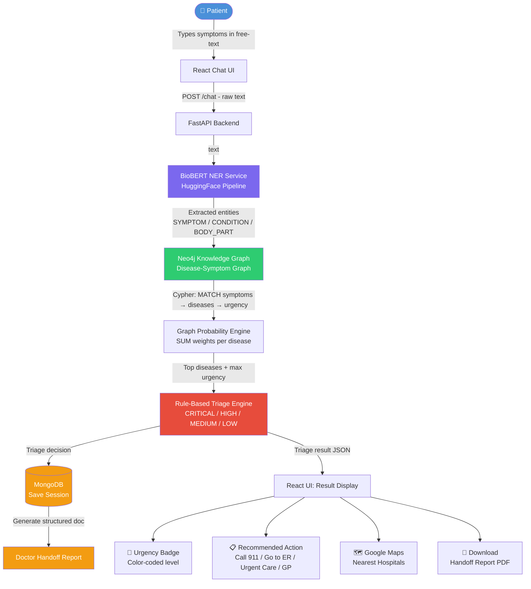

# System Architecture Flowchart
# Render at: https://mermaid.live



## Urgency Level Color Codes

| Level | Color | Action |
|-------|-------|--------|
| 🔴 CRITICAL | Red | Call 911 immediately |
| 🟠 HIGH | Orange | Go to ER now |
| 🟡 MEDIUM | Yellow | Urgent care within 4 hours |
| 🟢 LOW | Green | Schedule GP appointment |

## Component Interaction Summary

```
User Input
    └─► BioBERT (NER) ──► Neo4j (Graph Query) ──► Triage Engine
                                                        │
                                              ┌─────────┴──────────┐
                                              ▼                    ▼
                                          MongoDB              React UI
                                       (Persistence)         (Display)
```
